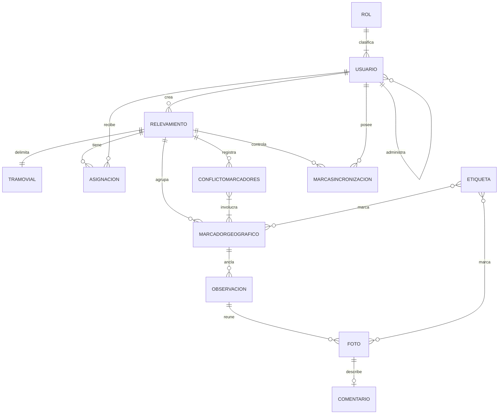

# Modelo conceptual — geovial-api

**Proyecto:** geovial-api
**Documento:** modelo-conceptual_v1.0.md
**Versión:** 1.0
**Estado:** Propuesto
**Fecha:** 2026-06-15
**Autor:** Analista Funcional + API Designer

## 0. Propósito y alcance

Este modelo conceptual describe las entidades del dominio que el backend de GeoVial gobierna y las relaciones entre ellas, sin tipos físicos ni decisiones de implementación, que viven en la categoría 05. Sirve de ancla a los casos de uso (CU) y las reglas de negocio (RN) de esta categoría y a las reglas conceptuales de modelo (RC) que aseguran su integridad. El modelo tiene 12 entidades, por encima de diez, por lo que se acompañan reglas conceptuales (RC) según la regla 02 §2.2.

## 1. Entidades

### 1.1 Usuario

Persona u operador del sistema con una identidad de acceso y un rol en la jerarquía. Cada usuario, salvo el raíz, fue dado de alta por un usuario administrador del nivel inmediato superior.
Ejemplo de instancia: un agente de campo dado de alta por un jefe de área, habilitado para tomar relevamientos asignados.

### 1.2 Rol

Nivel de la jerarquía que determina el alcance de un usuario: usuario raíz, jefe general, jefe de área o agente de campo. Fija qué administra y qué recursos opera.
Ejemplo de instancia: el rol jefe de área, que administra agentes de campo y gestiona relevamientos.

### 1.3 Relevamiento

Unidad de trabajo que registra observaciones del estado de un tramo vial y recorre el ciclo recolección, revisión y cierre. Lo crea un jefe de área y agrupa marcadores, observaciones y asignaciones.
Ejemplo de instancia: el relevamiento de un tramo con dos puentes y un camino, en estado de recolección.

### 1.4 TramoVial

Alcance geográfico de un relevamiento, compuesto por uno o varios puentes y caminos. Delimita qué extensión se releva.
Ejemplo de instancia: un tramo formado por el puente sobre el arroyo norte y el camino vecinal contiguo.

### 1.5 Asignacion

Vínculo entre un agente de campo y un relevamiento que lo habilita a recolectar en él. Se crea y se revoca por el jefe de área dueño del relevamiento.
Ejemplo de instancia: la asignación del agente A al relevamiento del tramo norte.

### 1.6 MarcadorGeografico

Punto del mapa, con una coordenada, que agrupa observaciones, fotos, comentarios y etiquetas dentro de un relevamiento. Tiene identidad propia y estable, y puede ser compartido por varias observaciones.
Ejemplo de instancia: un marcador sobre la pila central de un puente, con varias observaciones de fisuras.

### 1.7 ConflictoMarcadores

Situación en la que dos o más marcadores de un relevamiento caen dentro de un mismo radio. Es un estado válido que convive con la operación y se resuelve al cierre como unificación o separación.
Ejemplo de instancia: el conflicto entre dos marcadores muy próximos que describen la misma junta desde ángulos distintos.

### 1.8 Observacion

Registro del estado de un punto del tramo, anclado a un marcador geográfico, compuesto por una nota y un conjunto de fotos con sus comentarios y etiquetas. Tiene un autor identificado.
Ejemplo de instancia: una observación anclada a un marcador, con una nota sobre una fisura y dos fotos.

### 1.9 Foto

Imagen asociada a una observación, con su ubicación (incrustada o asignada), un comentario y una etiqueta. Su binario se aloja en el almacén de archivos a través de la librería de almacenamiento.
Ejemplo de instancia: una foto de una grieta, con la etiqueta fisura y un comentario sobre su extensión.

### 1.10 Comentario

Texto asociado a una foto que describe o contextualiza esa imagen.
Ejemplo de instancia: el comentario "fisura longitudinal de unos 30 centímetros" sobre una foto.

### 1.11 Etiqueta

Marca aplicable a fotos y a marcadores para clasificarlos y filtrarlos en la revisión.
Ejemplo de instancia: la etiqueta fisura aplicada a varias fotos y marcadores de un relevamiento.

### 1.12 MarcaSincronizacion

Referencia opaca que registra el punto de sincronización de un relevamiento para un cliente de campo, de modo que la bajada entregue solo las novedades posteriores. Sostiene el orden subir antes de bajar y la idempotencia.
Ejemplo de instancia: la marca de la última sincronización de un agente sobre su relevamiento asignado.

## 2. Atributos clave

| Entidad | Atributo | Semántica | Restricción conceptual |
| --- | --- | --- | --- |
| Usuario | IdentificadorAcceso | Identidad con la que el usuario se autentica | Única en todo el sistema |
| Usuario | EstadoHabilitacion | Si el usuario puede o no autenticarse | La baja inhabilita sin borrar (RN-02) |
| Usuario | AdministradoPor | Usuario del nivel inmediato superior que lo dio de alta | Obligatorio salvo para el rol raíz (RC-03) |
| Rol | Nivel | Posición en la jerarquía de cuatro niveles | Valor de un catálogo cerrado |
| Relevamiento | Estado | Etapa del ciclo: recolección, revisión o cierre | Transiciones acotadas por RN-05 (RC-04) |
| Relevamiento | CreadoPor | Jefe de área que lo creó | Obligatorio |
| TramoVial | ComposicionPuentesCaminos | Conjunto de puentes y caminos que abarca | No vacío (CU-04) |
| Asignacion | Agente, Relevamiento | Par que define la asignación | Único por par (RC-05) |
| MarcadorGeografico | Identidad | Identidad propia y estable del marcador | Estable ante movimiento y etiquetado (RC-01) |
| MarcadorGeografico | Coordenada | Ubicación geográfica del marcador | Dentro del rango geográfico admitido |
| ConflictoMarcadores | Estado | Pendiente o resuelto | Resuelto es precondición de cierre (RN-05) |
| Observacion | MarcadorAnclado | Marcador al que se ancla la observación | Obligatorio y existente (RC-02) |
| Observacion | Autor | Usuario que registró la observación | Obligatorio, conservado en la baja (RN-02) |
| Foto | Ubicacion | Coordenada de la foto, incrustada o asignada | Priorizada de la imagen en carga manual (RN-04) |
| Foto | ReferenciaAlmacen | Referencia lógica al binario en el almacén | Provista por la librería de almacenamiento |
| Etiqueta | Nombre | Marca de clasificación | Reutilizable entre fotos y marcadores |
| MarcaSincronizacion | Valor | Punto de sincronización opaco | Monótona por relevamiento y cliente (RC-06) |

## 3. Relaciones

- Un Rol clasifica a muchos Usuarios; cada Usuario tiene un Rol.
- Un Usuario administrador da de alta a muchos Usuarios del nivel inmediato inferior; cada Usuario administrado depende de un administrador (autorreferencia jerárquica).
- Un Jefe de área (Usuario) crea muchos Relevamientos; cada Relevamiento fue creado por un Usuario.
- Un Relevamiento delimita un TramoVial; cada TramoVial pertenece a un Relevamiento.
- Un Relevamiento tiene muchas Asignaciones; cada Asignacion vincula un Agente (Usuario) con un Relevamiento.
- Un Relevamiento agrupa muchos MarcadoresGeograficos; cada Marcador pertenece a un Relevamiento.
- Un Relevamiento puede tener muchos ConflictosMarcadores; cada Conflicto involucra dos o más Marcadores de ese Relevamiento.
- Un MarcadorGeografico ancla muchas Observaciones; cada Observacion se ancla a un Marcador y un Marcador puede ser compartido por varias Observaciones.
- Una Observacion reúne muchas Fotos; cada Foto pertenece a una Observacion.
- Una Foto tiene a lo sumo un Comentario; cada Comentario describe una Foto.
- Una Etiqueta marca muchas Fotos y muchos Marcadores; una Foto y un Marcador pueden tener varias Etiquetas.
- Un Relevamiento tiene muchas MarcasSincronizacion, una por cliente de campo; cada Marca pertenece a un Relevamiento y a un cliente.

## 4. Cardinalidades

| Relación | Cardinalidad |
| --- | --- |
| Rol — Usuario | 1 —— 1..N |
| Usuario administrador — Usuario administrado | 0..1 —— 0..N |
| Usuario (jefe de área) — Relevamiento | 1 —— 0..N |
| Relevamiento — TramoVial | 1 —— 1 |
| Relevamiento — Asignacion | 1 —— 0..N |
| Usuario (agente) — Asignacion | 1 —— 0..N |
| Relevamiento — MarcadorGeografico | 1 —— 0..N |
| Relevamiento — ConflictoMarcadores | 1 —— 0..N |
| ConflictoMarcadores — MarcadorGeografico | 1 —— 2..N |
| MarcadorGeografico — Observacion | 1 —— 0..N |
| Observacion — Foto | 1 —— 0..N |
| Foto — Comentario | 1 —— 0..1 |
| Etiqueta — Foto | 0..N —— 0..N |
| Etiqueta — MarcadorGeografico | 0..N —— 0..N |
| Relevamiento — MarcaSincronizacion | 1 —— 0..N |

## 5. Reglas conceptuales

El modelo invoca las siguientes reglas conceptuales de integridad, una por archivo en `reglas-conceptuales-de-modelo/`:

- RC-01 — Identidad estable del marcador geográfico.
- RC-02 — Referencia obligatoria de observación a marcador.
- RC-03 — Integridad de la jerarquía de usuarios.
- RC-04 — Estado del relevamiento dentro del ciclo válido.
- RC-05 — Unicidad de la asignación agente-relevamiento.
- RC-06 — Monotonía de la marca de sincronización.

## 6. Glosario

Los términos del dominio se reutilizan del glosario de la solución (intake §12 y vision-producto §9): Relevamiento, TramoVial, Observacion, Marcador geográfico, Conflicto de marcadores, Agente de campo, Jefe de área, Jefe general, Usuario raíz, Etiqueta, Sincronización, Radio de agrupación. Términos propios de este modelo:

- Asignacion: vínculo que habilita a un agente a recolectar en un relevamiento.
- MarcaSincronizacion: referencia opaca del punto de sincronización de un relevamiento para un cliente.
- Autoría: atribución permanente de un registro al usuario que lo creó, conservada ante la baja.

## 7. Diagrama

## 8. Trazabilidad

| Entidad | CU que la consumen | RN que la restringen |
| --- | --- | --- |
| Usuario | CU-01, CU-02, CU-03, CU-18 | RN-01, RN-02 |
| Rol | CU-01, CU-02, CU-03, CU-18 | RN-01 |
| Relevamiento | CU-04, CU-05, CU-06, CU-12, CU-14, CU-15, CU-16 | RN-05 |
| TramoVial | CU-04 | RN-05 |
| Asignacion | CU-05, CU-10, CU-11 | RN-01 |
| MarcadorGeografico | CU-07, CU-08, CU-09, CU-12, CU-13 | RN-03, RN-04 |
| ConflictoMarcadores | CU-07, CU-10, CU-12, CU-13, CU-14 | RN-03, RN-05 |
| Observacion | CU-08, CU-09, CU-10, CU-11, CU-13 | RN-03, RN-04 |
| Foto | CU-08, CU-09, CU-15, CU-16 | RN-04 |
| Comentario | CU-08, CU-12, CU-15, CU-16 | — |
| Etiqueta | CU-07, CU-08, CU-12, CU-13 | RN-04 |
| MarcaSincronizacion | CU-10, CU-11, CU-21 | RN-06, RN-07 |

## 9. Control de cambios

| Versión | Fecha | Cambios |
| --- | --- | --- |
| 1.0 | 2026-06-15 | Modelo conceptual inicial de geovial-api con 12 entidades, relaciones, cardinalidades, diagrama y trazabilidad a CU y RN; se acompañan seis RC por superar las diez entidades. |
