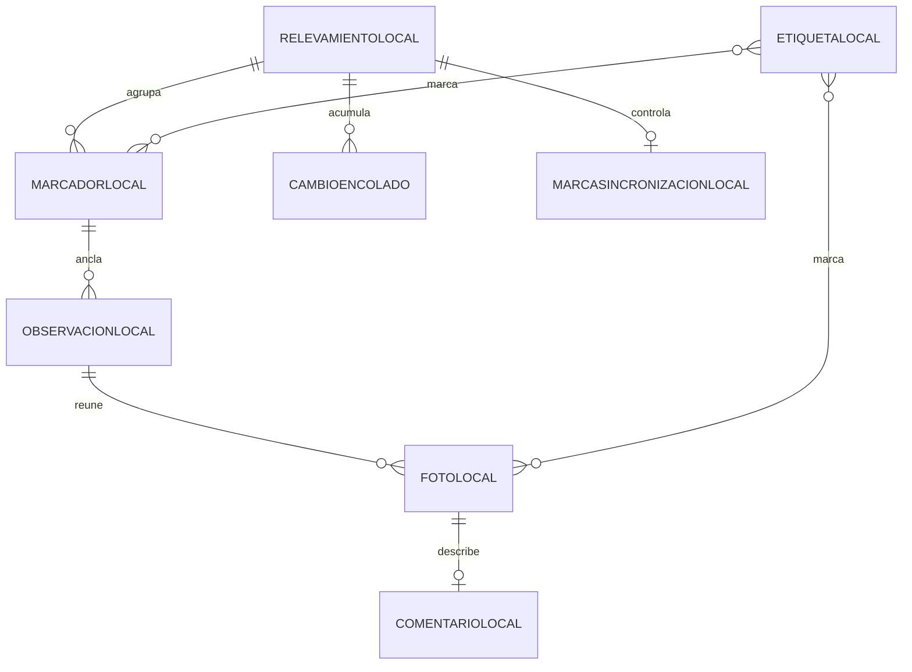

# Modelo conceptual — almacén local de geovial-mobile

**Proyecto:** geovial-mobile
**Documento:** modelo-conceptual_v1.0.md
**Versión:** 1.0
**Estado:** Propuesto
**Fecha:** 2026-06-15
**Autor:** Analista Funcional + Mobile UX Analyst

## 0. Propósito y alcance

Este modelo conceptual describe las entidades que la app móvil mantiene en el almacén local del dispositivo para trabajar offline-first, sin tipos físicos ni decisiones de implementación, que viven en la categoría 05. El dominio autoritativo es el de geovial-api (ver `proyectos/geovial-api/02_especificacion_funcional/modelo-datos/modelo-conceptual_v1.0.md`): el modelo local es una réplica parcial para el trabajo sin conexión, no la fuente de verdad. Cuando la app sincroniza, sube los cambios locales y baja las actualizaciones del backend, que prevalecen como dominio gobernado por el servidor.

El modelo local agrupa tres clases de entidades: las copias locales de las entidades de recolección del agente (relevamiento, marcador, observación, foto, comentario y etiqueta), la cola de cambios pendientes de sincronizar y los metadatos de sincronización. Tiene 8 entidades, por debajo de diez, por lo que no se acompañan reglas conceptuales de modelo (RC), según la regla 02 §2.2. La integridad de dominio fina (identidad estable del marcador, referencia obligatoria de observación a marcador, monotonía de la marca de sincronización) la garantiza el backend a través de sus RC; el cliente las respeta como invariantes replicadas.

## 1. Entidades

### 1.1 RelevamientoLocal

Copia local de un relevamiento asignado al agente, con su tramo y su estado, que sirve de contexto de captura sin conexión. Réplica de la entidad Relevamiento del backend.
Ejemplo de instancia: la copia local del relevamiento del tramo norte en estado de recolección, asignado al agente.

### 1.2 MarcadorLocal

Copia local de un marcador geográfico del relevamiento, con su coordenada e identidad estable, creado en terreno o por carga manual y agrupador de observaciones locales. Réplica de la entidad MarcadorGeografico del backend.
Ejemplo de instancia: un marcador local sobre la pila central de un puente, con varias observaciones de fisuras.

### 1.3 ObservacionLocal

Copia local de una observación anclada a un marcador local, con su nota y su autor, que reúne fotos locales. Réplica de la entidad Observacion del backend.
Ejemplo de instancia: una observación local anclada a un marcador, con una nota sobre una fisura y dos fotos.

### 1.4 FotoLocal

Copia local de una foto de una observación, con su ubicación (resuelta del GPS en el momento o incrustada en la imagen, o pendiente de ubicación), su comentario y sus etiquetas; su binario se aloja en el dispositivo hasta sincronizar. Réplica de la entidad Foto del backend.
Ejemplo de instancia: una foto local de una grieta con la etiqueta fisura, pendiente de ubicación precisa por falta de señal de GPS.

### 1.5 ComentarioLocal

Copia local del texto asociado a una foto local que la describe o contextualiza. Réplica de la entidad Comentario del backend.
Ejemplo de instancia: el comentario local "fisura longitudinal de 30 cm" sobre una foto.

### 1.6 EtiquetaLocal

Copia local de una etiqueta aplicable a fotos y a marcadores locales para clasificarlos, reutilizable dentro del relevamiento. Réplica de la entidad Etiqueta del backend.
Ejemplo de instancia: la etiqueta fisura aplicada localmente a varias fotos y marcadores.

### 1.7 CambioEncolado

Registro de un cambio local pendiente de sincronizar, que referencia el elemento afectado (marcador, observación, foto, comentario o etiqueta) y conserva el orden de creación y un identificador de origen estable para la idempotencia. Es la cola local persistente.
Ejemplo de instancia: el cambio encolado que representa la creación de un marcador, aún no confirmado por el backend.

### 1.8 MarcaSincronizacionLocal

Metadato que registra el punto de sincronización del relevamiento en el dispositivo, de modo que la bajada solicite solo las novedades posteriores. Réplica local de la MarcaSincronizacion del backend; la gestiona la librería de sincronización.
Ejemplo de instancia: la marca de la última sincronización del agente sobre su relevamiento asignado.

## 2. Atributos clave

| Entidad | Atributo | Semántica | Restricción conceptual |
| --- | --- | --- | --- |
| RelevamientoLocal | Identidad | Identidad del relevamiento, replicada del backend | Coincide con la del backend |
| RelevamientoLocal | Estado | Etapa del ciclo replicada: recolección, revisión o cierre | Solo lectura en el cliente; la transición la gobierna el backend |
| MarcadorLocal | Identidad | Identidad propia y estable del marcador | Estable ante movimiento y etiquetado (replica RC-01 del backend) |
| MarcadorLocal | Coordenada | Ubicación geográfica del marcador | Tomada del GPS o fijada en el mapa |
| ObservacionLocal | MarcadorAnclado | Marcador local al que se ancla | Obligatorio y existente en local (replica RC-02 del backend) |
| ObservacionLocal | Autor | Agente que la registró | Obligatorio |
| FotoLocal | Ubicacion | Coordenada de la foto, del momento o incrustada | Puede quedar pendiente de ubicación, sin inventarse |
| FotoLocal | ReferenciaBinarioLocal | Referencia al binario alojado en el dispositivo | Provista por el almacenamiento local hasta sincronizar |
| ComentarioLocal | Texto | Descripción de la foto | A lo sumo uno por foto |
| EtiquetaLocal | Nombre | Marca de clasificación | No vacío; reutilizable entre fotos y marcadores |
| CambioEncolado | IdentificadorOrigen | Identidad estable del cambio para idempotencia | Único por cambio; reconoce reenvíos |
| CambioEncolado | OrdenCreacion | Posición del cambio en la cola | Monótona; preserva el orden de captura |
| CambioEncolado | EstadoSincronizacion | Pendiente o confirmado | Confirmado se retira de la cola tras la subida |
| MarcaSincronizacionLocal | Valor | Punto de sincronización opaco del relevamiento | Monótono por relevamiento (replica RC-06 del backend) |

## 3. Relaciones

- Un RelevamientoLocal agrupa muchos MarcadoresLocales; cada MarcadorLocal pertenece a un RelevamientoLocal.
- Un MarcadorLocal ancla muchas ObservacionesLocales; cada ObservacionLocal se ancla a un MarcadorLocal y un MarcadorLocal puede ser compartido por varias ObservacionesLocales.
- Una ObservacionLocal reúne muchas FotosLocales; cada FotoLocal pertenece a una ObservacionLocal.
- Una FotoLocal tiene a lo sumo un ComentarioLocal; cada ComentarioLocal describe una FotoLocal.
- Una EtiquetaLocal marca muchas FotosLocales y muchos MarcadoresLocales; una FotoLocal y un MarcadorLocal pueden tener varias EtiquetasLocales.
- Un RelevamientoLocal acumula muchos CambiosEncolados; cada CambioEncolado referencia un elemento local de ese relevamiento.
- Un RelevamientoLocal tiene una MarcaSincronizacionLocal vigente; cada MarcaSincronizacionLocal pertenece a un RelevamientoLocal.

## 4. Cardinalidades

| Relación | Cardinalidad |
| --- | --- |
| RelevamientoLocal — MarcadorLocal | 1 —— 0..N |
| MarcadorLocal — ObservacionLocal | 1 —— 0..N |
| ObservacionLocal — FotoLocal | 1 —— 0..N |
| FotoLocal — ComentarioLocal | 1 —— 0..1 |
| EtiquetaLocal — FotoLocal | 0..N —— 0..N |
| EtiquetaLocal — MarcadorLocal | 0..N —— 0..N |
| RelevamientoLocal — CambioEncolado | 1 —— 0..N |
| RelevamientoLocal — MarcaSincronizacionLocal | 1 —— 0..1 |

## 5. Reglas conceptuales

El modelo local tiene 8 entidades, por debajo de diez, por lo que no incorpora reglas conceptuales de modelo (RC) propias (02 §2.2). Las invariantes de integridad de dominio que el cliente respeta como réplica las define y verifica el backend en su modelo conceptual: identidad estable del marcador (geovial-api RC-01), referencia obligatoria de observación a marcador (geovial-api RC-02) y monotonía de la marca de sincronización (geovial-api RC-06). En el cliente, esas invariantes se sostienen mediante las reglas de negocio RN-03 (convivencia con conflictos) y RN-05 (captura sin conexión), y la idempotencia y el orden de la cola por RN-02.

## 6. Glosario

Los términos del dominio se reutilizan del glosario de la solución (intake §12) y del modelo conceptual de geovial-api: Relevamiento, Marcador geográfico, Observación, Foto, Comentario, Etiqueta, Conflicto de marcadores, Radio de agrupación, Sincronización, Marca de sincronización. Términos propios del modelo local:

- Almacén local: el almacenamiento del dispositivo donde la app guarda la réplica de trabajo offline.
- Copia local: réplica parcial de una entidad del dominio del backend, mantenida en el dispositivo para trabajar sin conexión.
- Cola local: conjunto ordenado de cambios pendientes de sincronizar (CambioEncolado).
- Cambio encolado: registro de una modificación local aún no confirmada por el backend, con identificador de origen para la idempotencia.

## 7. Diagrama

## 8. Trazabilidad

| Entidad | CU que la consumen | RN que la restringen |
| --- | --- | --- |
| RelevamientoLocal | CU-02, CU-03, CU-04, CU-05, CU-06, CU-07 | RN-05 |
| MarcadorLocal | CU-03, CU-04, CU-07 | RN-01, RN-03, RN-05 |
| ObservacionLocal | CU-04, CU-05, CU-07 | RN-05 |
| FotoLocal | CU-04, CU-05, CU-07 | RN-01, RN-05 |
| ComentarioLocal | CU-05 | RN-05 |
| EtiquetaLocal | CU-05, CU-07 | RN-05 |
| CambioEncolado | CU-03, CU-04, CU-05, CU-06, CU-07 | RN-02, RN-05 |
| MarcaSincronizacionLocal | CU-06 | RN-02 |

## 9. Control de cambios

| Versión | Fecha | Cambios |
| --- | --- | --- |
| 1.0 | 2026-06-15 | Modelo conceptual inicial del almacén local de geovial-mobile: 8 entidades (6 copias locales de recolección, la cola de cambios y la marca de sincronización), relaciones, cardinalidades, diagrama y trazabilidad a CU y RN. Réplica del dominio autoritativo de geovial-api; sin RC por estar bajo diez entidades. |
