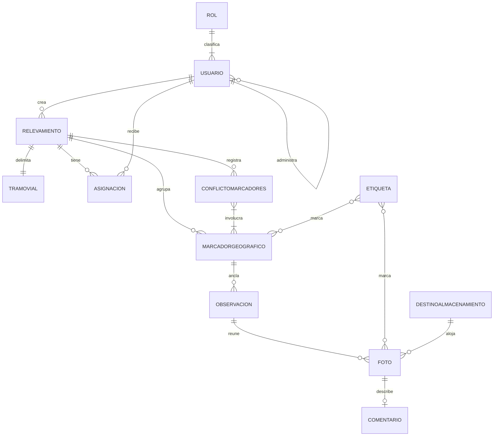

# Modelo conceptual — geovial-web

**Proyecto:** geovial-web
**Documento:** modelo-conceptual_v1.0.md
**Versión:** 1.0
**Estado:** Propuesto
**Fecha:** 2026-06-15
**Autor:** Analista Funcional

## 0. Propósito y alcance

Este modelo conceptual describe las entidades del dominio que el front web presenta y manipula desde la óptica del usuario, para anclar los casos de uso (CU) y las reglas de negocio (RN) de presentación y flujo de esta categoría. El front web no posee modelo de dominio propio ni persistencia: el modelo AUTORITATIVO es el de `geovial-api` (`docs/proyectos/geovial-api/02_especificacion_funcional/modelo-datos/modelo-conceptual_v1.0.md`), de doce entidades con sus reglas conceptuales (RC). Este documento es una referencia de consumo, no una redefinición: enumera las entidades tal como la interfaz las muestra y el subconjunto que cada pantalla manipula, sin reglas conceptuales propias y sin tipos físicos (que viven en 05). El front no declara invariantes de integridad: los garantiza el backend.

## 1. Entidades

Las entidades que el front web presenta son las del modelo autoritativo de `geovial-api`. Se listan las que la interfaz manipula directamente; las restantes del modelo fuente (por ejemplo MarcaSincronizacion) no tienen presencia en el front porque pertenecen al flujo de sincronización de la aplicación de campo.

### 1.1 Usuario

Persona que el front presenta en la administración de usuarios y como autor identificado de la evidencia. El front lo muestra con su identificador de acceso, su rol y su estado de habilitación.
Ejemplo de instancia: un agente de campo listado por su jefe de área, mostrado como dado de baja pero con su autoría conservada.

### 1.2 Rol

Nivel jerárquico que el front usa para decidir qué pantallas, listados y acciones habilita a cada usuario. El front lo recibe en la sesión y no lo modifica.
Ejemplo de instancia: el rol jefe de área, que habilita las pantallas de relevamientos, agentes y revisión.

### 1.3 Relevamiento

Unidad de trabajo que el front presenta en su listado y en el mapa, con su estado del ciclo (recolección, revisión, cierre). Es el eje de la mayoría de las pantallas del front.
Ejemplo de instancia: el relevamiento "Tramo Norte" mostrado en revisión, con sus marcadores sobre el mapa.

### 1.4 TramoVial

Alcance geográfico del relevamiento que el front presenta como la composición de puentes y caminos al crear o editar un relevamiento.
Ejemplo de instancia: un tramo formado por dos puentes y un camino vecinal capturado en el formulario de creación.

### 1.5 Asignacion

Vínculo agente-relevamiento que el front presenta y administra en la sección de agentes de un relevamiento, para asignar y reasignar.
Ejemplo de instancia: la asignación de un agente a "Tramo Norte" mostrada en la lista de asignados.

### 1.6 MarcadorGeografico

Punto sobre el mapa que el front presenta, crea y mueve, y alrededor del cual organiza el carrusel de fotos en la revisión.
Ejemplo de instancia: un marcador inicial sobre un puente, con la etiqueta "acceso", fijado en el mapa.

### 1.7 ConflictoMarcadores

Situación de marcadores dentro de un mismo radio que el front señala durante la revisión y presenta en la pantalla de resolución al cierre.
Ejemplo de instancia: el conflicto entre dos marcadores próximos que el jefe ve pendiente antes de cerrar.

### 1.8 Observacion

Registro anclado a un marcador que el front presenta en la revisión y que el agente completa en la carga manual, con su nota y sus fotos.
Ejemplo de instancia: una observación con una nota sobre una fisura y dos fotos, mostrada al recorrer su marcador.

### 1.9 Foto

Imagen que el front muestra en el carrusel, amplía y, en la carga manual, sube para que el backend la agrupe por ubicación y radio.
Ejemplo de instancia: una foto de una grieta mostrada en el carrusel con su comentario y etiqueta.

### 1.10 Comentario

Texto asociado a una foto que el front muestra junto a ella y que el agente completa en la carga manual.
Ejemplo de instancia: el comentario "fisura longitudinal de unos 30 centímetros" mostrado bajo una foto.

### 1.11 Etiqueta

Marca de clasificación que el front aplica a fotos y marcadores y por la que filtra en la revisión.
Ejemplo de instancia: la etiqueta "fisura" usada para filtrar los marcadores críticos del relevamiento.

### 1.12 DestinoAlmacenamiento

Configuración que el front presenta al usuario raíz para elegir dónde se alojan las fotografías. Es una proyección de la configuración que gobierna el backend; el front solo la muestra y envía la selección.
Ejemplo de instancia: el destino vigente "infraestructura propia" mostrado en la pantalla de configuración del raíz.

## 2. Atributos clave

Sin tipos físicos (viven en 05). El front no define semántica nueva: reutiliza la del modelo autoritativo de `geovial-api`. Se listan los atributos que la interfaz presenta o captura.

| Entidad | Atributo | Semántica | Restricción conceptual |
| --- | --- | --- | --- |
| Usuario | IdentificadorAcceso | Identidad mostrada y capturada en el alta | Definida y validada por el backend |
| Usuario | Rol | Nivel jerárquico del usuario | Acota lo que el front habilita (RN-01 web) |
| Usuario | EstadoHabilitacion | Si el usuario puede acceder | La baja se muestra sin perder autoría (RN-02 web) |
| Rol | Nivel | Posición en la jerarquía de cuatro niveles | Recibido en la sesión; no editable por el front |
| Relevamiento | Estado | Etapa del ciclo presentada en pantalla | Habilita u oculta acciones (RN-04 web) |
| TramoVial | ComposicionPuentesCaminos | Puentes y caminos capturados en el formulario | No vacío al crear (CU-03) |
| Asignacion | Agente, Relevamiento | Par mostrado en la sección de agentes | Único por par, garantizado por el backend |
| MarcadorGeografico | Coordenada | Ubicación capturada o movida sobre el mapa | Dentro del rango admitido por el backend |
| ConflictoMarcadores | Estado | Pendiente o resuelto, mostrado al cierre | Resuelto es condición visible del cierre (RN-05 web) |
| Observacion | Autor | Usuario que la registró, mostrado en revisión | Conservado pese a la baja (RN-02 web) |
| Foto | Ubicacion | Coordenada mostrada o pendiente en carga manual | Priorizada de la imagen por el backend (RN-04 web) |
| Etiqueta | Nombre | Marca usada para filtrar en la revisión | Reutilizable entre fotos y marcadores |
| DestinoAlmacenamiento | Seleccion | Destino elegido por el usuario raíz | Solo el raíz lo cambia (RN-01 web) |

## 3. Relaciones

Las relaciones son las del modelo autoritativo de `geovial-api`; el front las presenta sin alterarlas.

- Un Rol clasifica a muchos Usuarios; el front habilita pantallas según el Rol de cada Usuario.
- Un Usuario administrador da de alta a Usuarios del nivel inmediato inferior; el front lista solo los administrables por el solicitante.
- Un Jefe de área (Usuario) crea muchos Relevamientos; el front lista los del jefe.
- Un Relevamiento delimita un TramoVial; el front lo captura al crear o editar.
- Un Relevamiento tiene muchas Asignaciones; el front las administra en la sección de agentes.
- Un Relevamiento agrupa muchos MarcadoresGeograficos; el front los muestra sobre el mapa.
- Un Relevamiento puede tener muchos ConflictosMarcadores; el front los señala y los presenta para resolver al cierre.
- Un MarcadorGeografico ancla muchas Observaciones; el front recorre sus observaciones en la revisión.
- Una Observacion reúne muchas Fotos; el front las muestra en el carrusel.
- Una Foto tiene a lo sumo un Comentario; el front lo muestra junto a la foto.
- Una Etiqueta marca muchas Fotos y muchos Marcadores; el front filtra por etiqueta.
- El DestinoAlmacenamiento aplica a las Fotos de todo el sistema; el front lo presenta solo al usuario raíz.

## 4. Cardinalidades

Reflejo de las cardinalidades del modelo autoritativo, acotado a lo que el front presenta.

| Relación | Cardinalidad |
| --- | --- |
| Rol — Usuario | 1 —— 1..N |
| Usuario administrador — Usuario administrado | 0..1 —— 0..N |
| Usuario (jefe de área) — Relevamiento | 1 —— 0..N |
| Relevamiento — TramoVial | 1 —— 1 |
| Relevamiento — Asignacion | 1 —— 0..N |
| Usuario (agente) — Asignacion | 1 —— 0..N |
| Relevamiento — MarcadorGeografico | 1 —— 0..N |
| Relevamiento — ConflictoMarcadores | 1 —— 0..N |
| ConflictoMarcadores — MarcadorGeografico | 1 —— 2..N |
| MarcadorGeografico — Observacion | 1 —— 0..N |
| Observacion — Foto | 1 —— 0..N |
| Foto — Comentario | 1 —— 0..1 |
| Etiqueta — Foto | 0..N —— 0..N |
| Etiqueta — MarcadorGeografico | 0..N —— 0..N |
| DestinoAlmacenamiento — Foto | 1 —— 0..N |

## 5. Reglas conceptuales

El front web no declara reglas conceptuales de modelo (RC): no posee invariantes de integridad propias. La integridad del dominio la garantizan las RC del modelo autoritativo de `geovial-api` (RC-01 a RC-06): identidad estable del marcador, referencia obligatoria de observación a marcador, integridad de la jerarquía de usuarios, estado del relevamiento dentro del ciclo válido, unicidad de la asignación y monotonía de la marca de sincronización. El front confía en esas garantías y las refleja en la presentación a través de sus reglas de negocio de flujo (RN-01 a RN-05 de geovial-web).

## 6. Glosario

Los términos del dominio se reutilizan del glosario de la solución (intake §12) y del modelo autoritativo de `geovial-api`: Relevamiento, TramoVial, Observacion, Marcador geográfico, Conflicto de marcadores, Agente de campo, Jefe de área, Jefe general, Usuario raíz, Etiqueta, Asignacion, Radio de agrupación. Término propio de la óptica del front:

- DestinoAlmacenamiento: proyección, en la interfaz del usuario raíz, de la configuración de almacenamiento de archivos que gobierna el backend; el front la presenta y envía la selección, no la persiste.

## 7. Diagrama

El diagrama presenta el subconjunto del modelo autoritativo de `geovial-api` que el front web manipula, más la proyección de la configuración de almacenamiento. No es un modelo propio: es una vista de consumo.

## 8. Trazabilidad

| Entidad | CU del front que la consumen | RN del front que la condicionan |
| --- | --- | --- |
| Usuario | CU-01, CU-02 | RN-01, RN-02, RN-03 |
| Rol | CU-01, CU-02, CU-11 | RN-01, RN-03 |
| Relevamiento | CU-03, CU-04, CU-05, CU-06, CU-07, CU-08, CU-09, CU-10 | RN-01, RN-04 |
| TramoVial | CU-03 | RN-04 |
| Asignacion | CU-04, CU-09 | RN-01 |
| MarcadorGeografico | CU-05, CU-06, CU-07, CU-09 | RN-04, RN-05 |
| ConflictoMarcadores | CU-06, CU-07, CU-08 | RN-05 |
| Observacion | CU-06, CU-09 | RN-02, RN-04 |
| Foto | CU-06, CU-09, CU-10, CU-11 | RN-04 |
| Comentario | CU-06, CU-09, CU-10 | — |
| Etiqueta | CU-05, CU-06, CU-07, CU-09 | RN-04 |
| DestinoAlmacenamiento | CU-11 | RN-01 |

## 9. Control de cambios

| Versión | Fecha | Cambios |
| --- | --- | --- |
| 1.0 | 2026-06-15 | Modelo conceptual inicial de geovial-web como vista de consumo del modelo autoritativo de geovial-api: entidades que la interfaz presenta y manipula, sin persistencia ni RC propias, con la proyección DestinoAlmacenamiento y trazabilidad a los CU y RN del front. |
